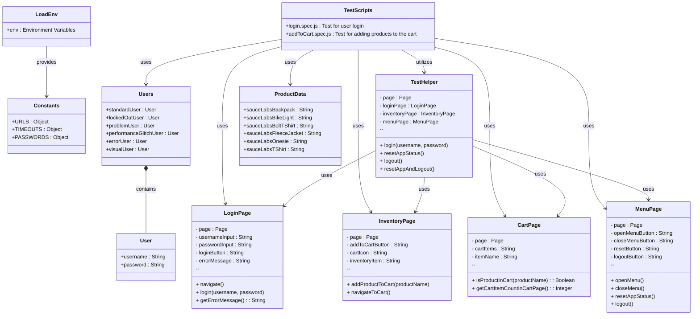

# Playwright POM Automation

An end-to-end (E2E) automation project using Playwright and the Page Object Model (POM) pattern to test the Sauce Demo web application.

## Table of Contents

- [Playwright POM Automation](#playwright-pom-automation)
  - [Table of Contents](#table-of-contents)
  - [Project Overview](#project-overview)
    - [System Architecture Diagram](#system-architecture-diagram)
  - [Technologies Used](#technologies-used)
  - [Prerequisites](#prerequisites)
  - [Project Structure](#project-structure)
  - [Installation](#installation)
    - [Clone the Repository:](#clone-the-repository)
    - [Navigate to the Project Directory:](#navigate-to-the-project-directory)
    - [Install Dependencies:](#install-dependencies)
    - [Install Playwright Browsers:](#install-playwright-browsers)
  - [Configuration](#configuration)
    - [Environment Variables](#environment-variables)
      - [Example .env File:](#example-env-file)
    - [Updating config.js](#updating-configjs)
  - [Usage](#usage)
    - [Running the Tests](#running-the-tests)
    - [Viewing Test Reports](#viewing-test-reports)

## Project Overview

This project automates the login, product selection, and cart verification flows of the Sauce Demo web application using Playwright and the Page Object Model design pattern.

### System Architecture Diagram

The following diagram illustrates the overall architecture of the automated testing system, showcasing the interaction between the test scripts and various components such as the login page, inventory page, and cart page.



## Technologies Used

- **Playwright**: For browser automation and testing.
- **Node.js**: JavaScript runtime environment.
- **dotenv**: For loading environment variables from a file.
- **Page Object Model (POM)**: Design pattern to organize automation code.

## Prerequisites

- **Node.js**: Version 14 or higher is recommended.
- **npm**: Comes with Node.js installation.
- **Visual Studio Code (VSCode)**: Optional but recommended for development.

## Project Structure

```lua
playwright-pom-automation/
├── config/                    # Configuration files
│   ├── constants.js           # Defines constants for URLs, timeouts, and passwords
│   └── loadEnv.js             # Loads environment variables from a .env file
├── data/                      # Contains data files
│   ├── products.js            # Contains information about available products
│   └── users.js               # Contains user credentials loaded from environment variables
├── pages/                     # Page Object Model classes for different pages
│   ├── basePage.js            # Base class for page objects
│   ├── cartPage.js            
│   ├── inventoryPage.js       
│   ├── loginPage.js           
│   └── menuPage.js            
├── helpers/                   # Helper functions for managing page interactions
│   └── testHelper.js          
├── tests/                     # Test scripts
│   ├── inventory/             
│   │   └── addToCart.spec.js  
│   └── login/                 
│       └── login.spec.js      
├── .gitignore                 
├── .prettierrc                # Configuration file for Prettier
├── .env                       # Environment variables
└── playwright.config.js       # Configuration file for Playwright
```
## Installation

### Clone the Repository:

```bash
git clone https://github.com/your-username/playwright-pom-automation.git
```

### Navigate to the Project Directory:

```bash
cd playwright-pom-automation
```

### Install Dependencies:

```bash
npm install
```

### Install Playwright Browsers:

```bash
npx playwright install
```

## Configuration

### Environment Variables

Sensitive data such as passwords are stored in a `.env` file located at a specific path on your system (e.g., `/path/to/your/env/.env`). This file should not be committed to version control.

#### Example .env File:

```dotenv
STANDARD_USER_PASSWORD=secret_sauce
LOCKED_OUT_USER_PASSWORD=secret_sauce
PROBLEM_USER_PASSWORD=secret_sauce
PERFORMANCE_GLITCH_USER_PASSWORD=secret_sauce
ERROR_USER_PASSWORD=secret_sauce
VISUAL_USER_PASSWORD=secret_sauce
```

> Note: Replace `/path/to/your/env/.env` with the actual path in `loadEnv.js`.

### Updating config.js

```javascript
// loadEnv.js

// Specify the path to your .env file
const envPath = path.resolve('/path/to/your/env/.env') // Replace with your actual path
```

## Usage

### Running the Tests

Execute the following command to run all tests:

```bash
npx playwright test
```

### Viewing Test Reports

After running the tests, you can generate and view an HTML report:

```bash
npx playwright show-report
```
